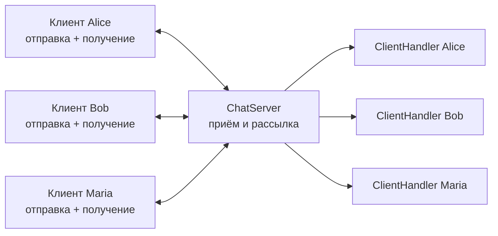

# Сетевой чат

Учебное консольное клиент-серверное приложение на Java для обмена текстовыми сообщениями по TCP между несколькими пользователями.

Проект состоит из двух Maven-модулей:

- `server` — принимает подключения и рассылает сообщения;
- `client` — отправляет сообщения пользователя и независимо принимает сообщения других участников.

## Возможности

- подключение нескольких клиентов к одному серверу;
- подключение новых пользователей во время работы чата;
- отдельный серверный поток для каждого клиента;
- независимая отправка и получение сообщений на клиенте;
- выбор имени пользователя;
- проверка уникальности имени среди подключённых пользователей;
- рассылка сообщения всем участникам, включая отправителя;
- отображение имени и времени отправки сообщения;
- выход из чата по команде `/exit`;
- логирование сообщений на сервере и в отдельном файле каждого пользователя;
- сохранение предыдущих записей логов после перезапуска;
- настройка адреса и порта через файлы;
- unit-тесты на JUnit и Mockito.

## Используемые технологии

- Java 25;
- TCP-сокеты (`ServerSocket`, `Socket`);
- Java Threads;
- Maven;
- JUnit Jupiter;
- Mockito.

## Архитектура

### Сервер

- `ServerApplication` читает настройки и запускает сервер.
- `ChatServer` ожидает подключения, хранит список активных клиентов и выполняет общую рассылку.
- `ClientHandler` обслуживает одного клиента в отдельном потоке: принимает имя и сообщения, пишет серверный лог и закрывает соединение при выходе.
- Для хранения клиентов используется потокобезопасная коллекция `CopyOnWriteArrayList`.

### Клиент

- `ClientApplication` читает настройки и устанавливает одно TCP-соединение с сервером.
- `inputSendingThread` читает ввод из консоли и отправляет сообщения.
- `constantReadingThread` постоянно принимает сообщения сервера, выводит их в консоль и записывает в лог.
- Основной поток управляет запуском и корректным завершением рабочих потоков и сокета.



## Протокол обмена

Протокол текстовый: одна строка соответствует имени, ответу сервера или сообщению.

### Регистрация имени

После подключения клиент отправляет имя:

```text
maria
```

Сервер отвечает:

```text
Свободно
```

Если имя уже используется:

```text
Занято
```

Клиент предлагает пользователю ввести другое имя. Минимальная длина имени — два символа.

### Передача сообщения

Клиент отправляет строку с разделителем `&`:

```text
[dd.MM.yyyy HH:mm:ss]&имя&текст
```

Пример:

```text
[20.08.2026 10:08:06]&maria&Всем привет!
```

Сервер рассылает участникам отформатированную строку:

```text
[20.08.2026 10:08:06] maria: Всем привет!
```

Команда `/exit` передаётся в поле текста сообщения и завершает соединение клиента.

## Структура проекта

```text
m7_kp_setevoy_chat_v1/
├── client/
│   ├── src/main/java/ru/netology/ClientApplication.java
│   ├── src/test/java/ru/netology/ClientApplicationTest.java
│   ├── logs/
│   │   └── <имя>-file.log
│   ├── settings.txt
│   └── pom.xml
├── server/
│   ├── src/main/java/ru/netology/ServerApplication.java
│   ├── src/main/java/ru/netology/ChatServer.java
│   ├── src/main/java/ru/netology/ClientHandler.java
│   ├── src/test/java/ru/netology/ServerApplicationTest.java
│   ├── src/test/java/ru/netology/ChatServerTest.java
│   ├── src/test/java/ru/netology/ClientHandlerTest.java
│   ├── settings.txt
│   ├── file.log
│   └── pom.xml
├── info/
├── pom.xml
└── README.md
```

## Требования для запуска

- JDK 25;
- Apache Maven;
- свободный TCP-порт, указанный в настройках.

Команды ниже необходимо выполнять из корня `m7_kp_setevoy_chat_v1`.

## Настройка

Файл сервера `server/settings.txt`:

```text
port=8080
```

Файл клиента `client/settings.txt`:

```text
host=localhost
port=8080
```

Порт клиента должен совпадать с портом сервера. Для подключения с другого компьютера вместо `localhost` нужно указать адрес машины, на которой запущен сервер.

## Сборка

Собрать оба модуля:

```bash
mvn clean package
```

## Запуск

Сначала запустить сервер:

```bash
java -cp server/target/classes ru.netology.ServerApplication
```

Затем в отдельных терминалах запустить необходимое количество клиентов:

```bash
java -cp client/target/classes ru.netology.ClientApplication
```

После подключения:

1. Ввести имя длиной не менее двух символов.
2. Если имя занято, выбрать другое.
3. Вводить сообщения в консоль.
4. Для выхода отправить `/exit`.

## Логирование

Сервер записывает сообщения в:

```text
server/file.log
```

Каждый клиент записывает полученные сообщения в отдельный файл, сформированный из имени пользователя:

```text
client/logs/<имя>-file.log
```

Например, для пользователя `danil`:

```text
client/logs/danil-file.log
```

Если файла пользователя ещё нет, клиент создаёт его при записи первого полученного сообщения. Каталог `client/logs` должен существовать до запуска клиента.

Логи открываются в режиме добавления: предыдущие записи не удаляются при новом запуске приложений.

Формат записи:

```text
[20.08.2026 10:08:06] maria: Всем привет!
```

## Тестирование

Запустить все unit-тесты:

```bash
mvn test
```

В проекте проверяются:

- чтение настроек клиента и сервера;
- запись клиентского и серверного логов;
- определение занятого и свободного имени;
- удаление клиента из списка подключений;
- вызов отправки сообщения при общей рассылке.

Для изоляции `ClientHandler` в тестах `ChatServer` используются mock-объекты Mockito.

## Ограничения

- символ `&` является служебным разделителем и не поддерживается внутри имени или текста сообщения;
- обработка отсутствующих или некорректных настроек пока ограничена;
- время сообщения формируется на стороне клиента.
